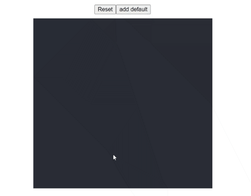

# marker

> hook that facilates creating markers on screen on click

[](https://www.npmjs.com/package/marker) [](https://standardjs.com)

## Install

```bash
npm install --save canvas-marker
```

## Usage

```jsx
import { useMarker } from 'canvas-marker'

function App() {
  const [setShowMarker, XY, setXY, setCurrentEvent] = useMarker(true);

  //pass canvas click event
  const getCoordinates = (e) => {
    setCurrentEvent(e);
  }

//remove all markers, i.e save state of markers beforehand if you plan to reuse the again
  const resetMarker = () => {
    setShowMarker(false);
  }
  
  //Add default marker points or from previous marker session
  const addDefaultCoordinates = () => {
    setXY([[419,275], [534,308]]);
  }

  const points = XY.map((xy, index) =>
  <span>{`marker`}</span>
);
  return (
    <div className="App">
      <button onClick={resetMarker}>Reset</button>
      <button onClick={addDefaultCoordinates}>add default</button>
      <div className="App-header" onClick={getCoordinates}>
       {points}
      </div>
    </div>
  );
```


## License

MIT © [abdullah-jaffer](https://github.com/abdullah-jaffer)

---

This hook is created using [create-react-hook](https://github.com/hermanya/create-react-hook).
